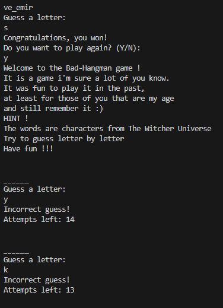

# Bad-Hangman Game

Welcome to the Bad-Hangman game! This is a simple Python implementation of the classic Hangman game with a Witcher Universe twist. In this game, players must guess the hidden word character by character before running out of attempts. Let's dive into the details:

## How to Play

1. **Setup**: Ensure you have Python installed on your system.
2. **Run the Game**: Execute the provided Python script `hangman.py` by running `python hangman.py` in your terminal.
3. **Game Instructions**: Follow the on-screen instructions to play the game. You'll be prompted to guess a letter at a time.
4. **Guessing Rules**: Enter a single letter as your guess. You have a limited number of attempts to guess the word correctly.
5. **Win or Lose**: If you successfully guess the word within the allowed attempts, you win! Otherwise, you lose the game.

# Hangman Game Features

1. **Welcome Message:**
   - Upon starting the game, players are greeted with a friendly welcome message providing instructions and background information about the game
2. **Random Word Selection:**
   - The game selects a random word from a predefined list of characters from The Witcher universe for players to guess.
3. **Display Word with Underscores:**
   - The selected word is initially displayed to the player as underscores, representing the letters to be guessed.
4. **Guessing Letters:**
   - Players are prompted to guess letters one by one to unveil the hidden word.
   - Letter guesses are case-insensitive and validated to ensure they are single alphabetical characters.
   - Players are informed if they have already guessed a letter and prompted to try again.
5. **Display Hangman Drawings:**
   - The game visually represents the player's progress with hangman drawings, which evolve based on the number of incorrect guesses.
   - Each incorrect guess leads to the progression of the hangman drawing until completion.
6. **Game Completion:**
   - Players win the game by successfully guessing all the letters in the word before exceeding the maximum allowed incorrect guesses.
   - A congratulatory message is displayed upon winning the game.
   - Players lose the game if they exceed the maximum allowed incorrect guesses.
   - A message displaying the correct word is shown upon losing the game.
7. **Play Again Option:**
   - After completing a game, players are given the option to play again.
   - Players can choose to play another round or exit the game based on their preference.
8. **Exit:**
   - Players can choose to exit the game.

.
.

## Testing

1. **PEP8**: Passed the code through a PEP8 linter and confirmed there are no problems.

## Manual Testing:

1. **Run the Code:**
   - Run the Python script containing the Hangman game code.
   - Ensure that the script runs without any errors.
2. **Welcome Message:**
   - Upon running the script, verify that the welcome message is displayed on the terminal.
   - Confirm that the welcome message contains the instructions and information about the game.
3. **Word Selection:**
   - Verify that the game selects a word from the provided list of Witcher characters.
   - Ensure that the selected word is not visible to the player.
4. **Guessing a Letter:**
   - Input a valid letter when prompted to guess a letter.
   - Ensure that the input is case-insensitive.
   - Verify that the input is a single alphabetical character.
   - Test guessing a letter that has already been guessed.
5. **Displaying the Word:**
   - After guessing a letter, check if the guessed letters are correctly displayed in the word.
   - Ensure that the unguessed letters are displayed as underscores.
6. **Drawing the Hangman:**
   - Verify that the hangman drawings are displayed correctly based on the number of incorrect guesses.
   - Confirm that the hangman drawings progress appropriately with each incorrect guess.
7. **Game Completion:**
   - Test scenarios where the player wins by guessing all the letters in the word.
   - Test scenarios where the player loses by exceeding the maximum number of incorrect guesses.
   - Ensure that appropriate win or lose messages are displayed.
8. **Play Again Option:**
   - After completing a game, verify that the player is prompted to play again.
   - Test both options (Yes/No) for playing again.
   - Ensure that the game restarts if the player chooses to play again.
9. **Exit Game:**
   - Test selecting 'No' when prompted to play again.
   - Verify that the game exits gracefully with a farewell message.

10. **Boundary Testing:**
    - Test boundary conditions, such as:
        - Guessing all letters correctly in the first attempt.
        - Exceeding the maximum allowed incorrect guesses.
        - Guessing the same letter multiple times.
        - Inputting non-alphabetical characters.

## Bugs

- Backwards counter did not print
- - Solution: Converted "attempts_left"  num-variable into a string (attempts_left_str = str(attempts_left)).
- Whitespace possible to type.
- - Solution: Removed possibillity with strip() method.
- User punished for guessing the same letter repeatedly.
- - Solution: Added elif to prevent that.

## Remainig Bugs

- No bugs remaining.

## Credits

- Part of code idea from [Stack Overflow](https://stackoverflow.com/).

## Deployment

1. **Log in or Register:**
   - Log in to your Heroku account or register a new account if you don't have one already.
2. **Create New App:**
   - Click on 'New' in the Heroku dashboard and select 'Create New App'.
3. **Name and Region:**
   - Choose a unique name for your app and select your preferred region.
4. **Create App:**
   - Click on "Create app" to create your new Heroku app.
5. **Settings:**
   - Once the app is created, navigate to the 'Settings' tab.
6. **Add Config Var:**
   - To improve compatibility with various Python libraries, add a Config Var with Key = PORT and the Value = 8000.
7. **Add Buildpacks:**
   - Add two buildpacks: Python and then Node.js, in this specific order.
8. **Deploy from GitHub:**
   - Go back to the top of the page and click on "Deploy", then select "GitHub".
9. **Connect to GitHub:**
   - Scroll down and click on 'Connect to GitHub'.
10. **Select Repository:**
    - Search for your GitHub repository name by typing it and click on "Connect".
11. **Deploy Branch:**
    - Scroll down and click on "Deploy Branch" to deploy your application.  
    - You can choose between automatic or manual deployment.
    
## Dependencies

This game requires Python to be installed on the system. No external libraries or dependencies are needed.

## How to Contribute

Contributions to improve this game are welcome! Here are a few ways you can contribute:

- Add additional features or enhancements to the gameplay.
- Improve the code structure or efficiency.
- Fix any bugs or issues you encounter.

To contribute, simply fork this repository, make your changes, and submit a pull request. Your contributions will be appreciated!

[Back to Top](#bad-hangman-game)
